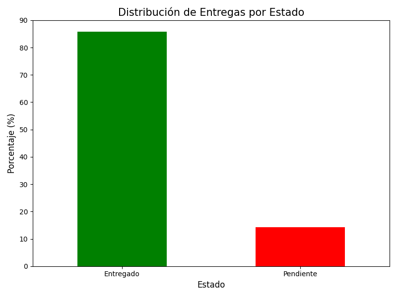
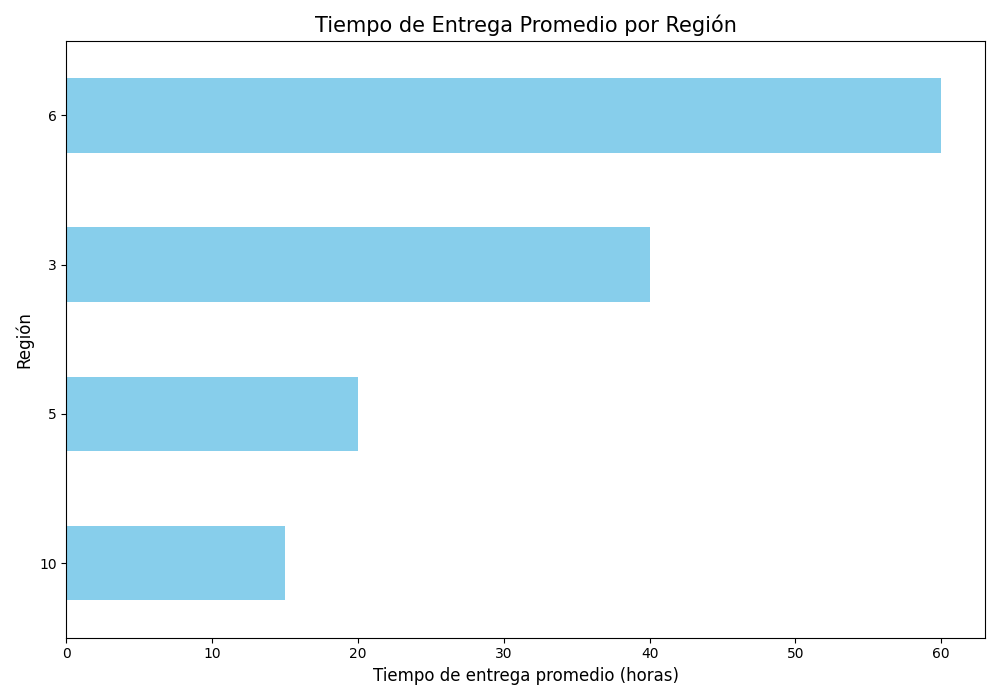

## 📈 Resultados del Análisis

El script `analisis.py` procesa los datos y genera los siguientes resultados:

1.  **Distribución de Entregas por Estado:**
    

2.  **Tiempo de Entrega Promedio por Región:**
    

Además, el script exporta un archivo de Excel llamado `reporte_entregas_retrasadas.xlsx` que contiene una lista de todas las entregas con estado 'Retrasado' para un análisis más detallado.

## ▶️ Cómo ejecutar el proyecto

Para ejecutar el análisis en tu entorno local, sigue estos pasos:

1.  Asegúrate de tener Python instalado.
2.  Instala las bibliotecas necesarias:
    ```bash
    pip install pandas matplotlib openpyxl
    ```
3.  Coloca tus archivos `clientes.xlsx`, `entregas.xlsx` y `transportistas.xlsx` en la carpeta `data`.
4.  Ejecuta el script desde tu terminal:
    ```bash
    python analisis.py
    ```

El script generará automáticamente los gráficos y el reporte de Excel en la carpeta `outputs`.
